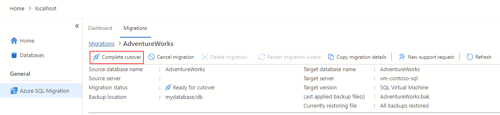

---
lab:
  title: SQL Server データベースを Azure 仮想マシン上の SQL Server に移行する
---

# SQL Server データベースを Azure 仮想マシン上の SQL Server に移行する

この演習では、Azure Data Studio 用の Azure 移行拡張機能を使用して、SQL Server データベースを Azure 仮想マシン上で実行されている SQL Server に移行する方法について説明します。 まず、Azure Data Studio 用の Azure 移行拡張機能をインストールして起動します。 次に、Azure 仮想マシンで実行されている SQL Server への SQL Server データベースのオンライン移行を実行します。 また、Azure portal で移行プロセスを監視し、カットオーバー プロセスを完了して移行を完了する方法についても説明します。

この演習には約 **45** 分かかります。

> **注**: この演習を完了するには、Azure サブスクリプションにアクセスして、Azure リソースを作成する必要があります。 Azure サブスクリプションをお持ちでない場合は、始める前に[無料アカウントを作成](https://azure.microsoft.com/free/?azure-portal=true)してください。

## 開始する前に

この演習を実行するには、次のものが必要です。

| 項目 | 説明 |
| --- | --- |
| **ターゲット サーバー** | Azure 仮想マシン上の SQL Server。 詳細については、[Azure 仮想マシンで SQL Server をプロビジョニングする](https://microsoftlearning.github.io/dp-300-database-administrator/Instructions/Labs/01-provision-sql-vm.html)を参照してください。 **注:** ターゲットとサーバーの間の SQL Server のバージョンは同じである必要があります。 |
| **ソース サーバー** | 選択したサーバーにインストールされている最新の [SQL Server](https://www.microsoft.com/en-us/sql-server/sql-server-downloads) のバージョン。 |
| **ソース データベース** | SQL Server 2022 インスタンスで復元される軽量の [AdventureWorks](https://learn.microsoft.com/sql/samples/adventureworks-install-configure) データベース。 |

## BLOB コンテナーがある Azure ストレージ アカウントをプロビジョニングする

Azure ストレージ アカウントを作成する目的は、移行用の完全バックアップとトランザクション ログ バックアップを格納することです。 このストレージ アカウントは後の手順で使用します。

1. [Azure portal](https://portal.azure.com/) にサインインします。
1. 左側のポータル メニューで **[ストレージ アカウント]** を選択して、ストレージ アカウントの一覧を表示します。 ポータル メニューが表示されない場合は、メニュー ボタンを選択してオンに切り替えます。
1. **[ストレージ アカウント]** ページで、**[作成]** を選択します。
1. **[プロジェクトの詳細]** で、Azure 仮想マシンを作成したのと同じ Azure サブスクリプションを選択します。
1. Azure 仮想マシンを作成したのと同じリソース グループを選択します。 
1. ストレージ アカウントの一意の名前を選択し、Azure 仮想マシンと同じリージョンを選択します。
1. サービス レベルとして **[Standard]** を選択します。
1. 残りのオプションについては既定値のままにします。
1. **[確認および作成]** を選択し、次に **[作成]** を選択します。

ストレージ アカウントが作成されたら、次の手順に従ってコンテナーを作成できます。

1. Azure portal で新しく作成されたストレージ アカウントに移動します。
1. ストレージ アカウントの左側のメニューで、**[BLOB サービス]** セクションまでスクロールし、**[コンテナー]** を選択します。
1. **[+ コンテナー]** を選択して、新しいコンテナーを作成します。
1. [新しいコンテナー側] ページで次の情報を入力します。
    - **名前:** *ユーザー設定の名前*
    - **パブリック アクセス レベル:** 非公開
1. **［作成］** を選択します

## Azure Data Studio 用の Azure 移行拡張機能をインストールして起動する

Azure 移行拡張機能の使用を開始する前に、[Azure Data Studio](https://learn.microsoft.com/sql/azure-data-studio/download-azure-data-studio) をインストールする必要があります。 このシナリオでは、ソース データベースがあるのと同じサーバーに Azure Data Studio をインストールします。 この拡張機能は、Azure Data Studio Marketplace で入手できます。

移行拡張機能をインストールするには、次の手順に従います。

1. Azure Data Studio で拡張機能マネージャーを開きます。
1. 「***Azure SQL 移行***」と検索して、この拡張機能を選択します。
1. 拡張機能をインストールします。 インストールすると、インストール済みの拡張機能の一覧に Azure SQL 移行拡張機能が表示されます。
1. Azure Data Studio で SQL Server インスタンスに接続します。
1. Azure 移行拡張機能を起動するには、ソース インスタンス名を右クリックし、**[管理]** を選択して、Azure SQL 移行拡張機能のダッシュボードとランディング ページにアクセスします。

## Azure 仮想マシンで実行されている SQL Server への SQL Server データベースのオンライン移行を実行する

Azure Data Studio を使用して最小限のダウンタイムでの移行を実行するには、次の手順に従います。

1. Azure Data Studio の拡張機能で Azure SQL への移行ウィザードを起動します。

1. **[手順 1: 評価用データベース]** で、移行するデータベースを選んでから、**[次へ]** を選択します。
    
    > **注**: パフォーマンス データを収集し、適切なサイズの Azure の推奨事項を取得することをお勧めします。

1. **[手順 2: 評価結果と推奨事項]** で、評価が完了するまで待ってから、**Azure SQL** ターゲットとして **Azure 仮想マシン上の SQL Server** を選択します。

1. **[手順 2: 評価結果と推奨事項]** ページの下部にある **[表示/選択]** を選択して評価結果を表示します。 移行するデータベースを選択します。 

    > **注**: 少し時間を取って、右側の評価結果を確認してください。

1. **[手順 3: Azure SQL ターゲット]** で、Azure アカウントと Azure 仮想マシン上のターゲット SQL Server を選択します。

    

1. **[手順 4: Azure Database Migration Service]** で、Azure Data Studio のウィザードを使用して、新しい Azure Database Migration Service を作成します。 以前に作成してある場合は、再利用できます。 または、Azure portal を使用して Azure Database Migration Service のリソースを作成することもできます。

    > **注**: サブスクリプションが名前空間 **Microsoft.DataMigration** を使用するように登録されていることを確認します。 リソース プロバイダーの登録を実行する方法については、「[リソース プロバイダーの登録](https://learn.microsoft.com/azure/dms/quickstart-create-data-migration-service-portal#register-the-resource-provider)」を参照してください。

1. ソース データベースをバックアップする。 [SSMS または T-SQL を使用して Microsoft Azure Blob Storage にバックアップ](https://learn.microsoft.com/en-us/sql/relational-databases/backup-restore/sql-server-backup-to-url)できます。 または、Azure portal を使用してデータベース バックアップをコンテナー フォルダーに手動でコピーすることもできます。

    > **注**: バックアップ ファイルのコピーを続行する前に、コンテナーにフォルダーが作成されていることを確認してください。

1. **[手順 5: データ ソースの構成]** で、オンプレミスのネットワーク共有または Azure Blob Storage コンテナー上のデータベース バックアップの場所を選択します。

1. データベースの移行を開始し、Azure Data Studio での進行状況を監視します。 Azure portal の Azure Database Migration Service リソースの下で進行状況を追跡することもできます。

    > **注**: Azure Data Migration Services は、ターゲット サーバーでバックアップ ファイルを自動的に調整および復元します。

1. 移行ダッシュボードで **[データベースの移行が進行中]** を選択して、進行中の移行を表示します。 

    

1. 詳細を確認するには、データベース名を選択します。

    

## Azure portal で移行を監視します

または、Azure Database Migration Service を使用して移行アクティビティを監視することもできます。 

1. 
    
    
## カットオーバー プロセスを完了する

1. ソース データベースの[ログ末尾のバックアップ](https://learn.microsoft.com/sql/relational-databases/backup-restore/tail-log-backups-sql-server)を作成します。

1. Azure portal で、トランザクション ログ バックアップを、完全なバックアップ ファイルがあるコンテナーとフォルダーにアップロードします。

1. Azure 移行拡張機能の監視ページで **[カットオーバーの完了]** を選択します。

    

1. すべてのログ バックアップがターゲット データベースに復元されていることを確認します。 **ログ バックアップの保留中の復元**の値は 0 にする必要があります。 この手順により、移行が完了します。

    

1. [移行の状態] プロパティが **[完了処理中]** に変わります。その後、移行が完了した後に **[成功]** に変わります。

    > **注**: Azure portal を使用して、Azure Database Migration Service で同様の手順を使用して、カットオーバーを完了できます。

1. 状態が **[成功]** になったら、ターゲット サーバーに移動し、ターゲット データベースを検証します。 データベース スキーマとデータを確認します。

Azure Data Studio 用の Azure 移行拡張機能を使用して、SQL Server データベースを Azure 仮想マシン上で実行されている SQL Server に移行する方法について説明しました。 また、移行を完了するためにカットオーバー プロセスを完了する方法についても説明しました。 これにより、すべてのデータが正常に移行され、新しいデータベースが完全に動作することが保証されます。 カットオーバー プロセスが完了したら、Azure 仮想マシンで実行されている新しい SQL Server データベースの使用を開始できます。 

## クリーンアップ

独自のサブスクリプションを使用している場合は、プロジェクトの最後に、作成したリソースがまだ必要かどうかを確認してください。 

リソースを不必要に実行したままにしておくと、追加コストが発生する可能性があります。 [Azure portal](https://portal.azure.com?azure-portal=true) でリソースを個別に削除することも、リソースのセット全体を削除することもできます。

## 詳細情報

Azure 仮想マシンの SQL Server の詳細については、「[Azure 仮想マシンにおける SQL Server の概要](https://learn.microsoft.com/en-us/azure/azure-sql/virtual-machines/windows/sql-server-on-azure-vm-iaas-what-is-overview?view=azuresql-vm)」を参照してください。
